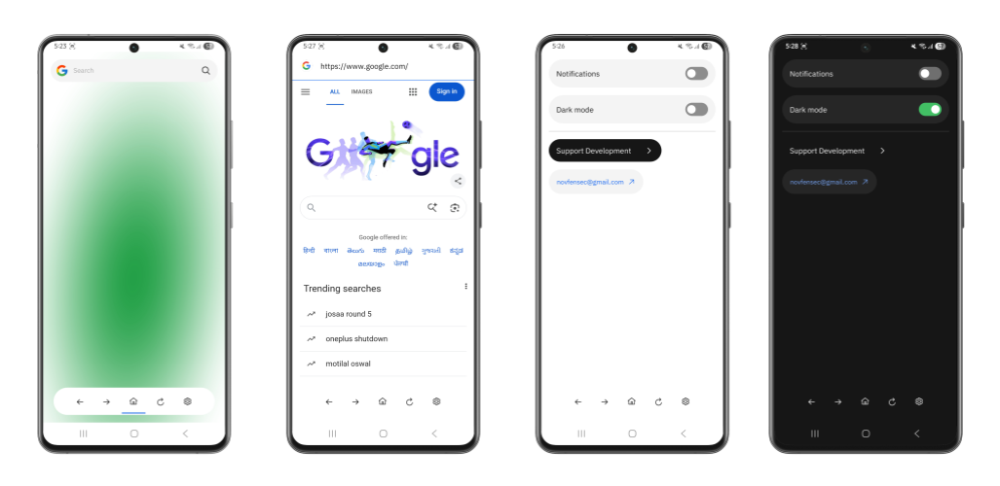

# NfsBrowser

NfsBrowser is a light-weight browser application in Python using Kivy, CarbonKivy and NfsWebview. 

NfsBrowser bypasses standard framework limitations by seamlessly bridging a highly customizable Python frontend with Android’s native Java WebView engine via a custom module (`nfswebview`). It delivers a truly native mobile experience featuring flawless full-screen video, advanced download management, intelligent deep linking, and dynamic UI theming.

## Overview

  

## GitAds Sponsored
<!-- GitAds-Verify: KIO8YZI9QZKHK2HDM7J36GXCFNS69DNZ -->

## Key Features

* **Custom Native Engine (`nfswebview`):** The heavy lifting (rendering, caching, downloading) is executed entirely in optimized Java, bridged asynchronously to Kivy via Pyjnius to ensure the Python UI never blocks the Android main thread.
* **Modern UI with CarbonKivy:** A sleek, responsive user interface featuring smooth animations, a bottom navigation bar, and instant Light/Dark mode toggling.
* **Advanced Download Manager:** A custom-built engine capable of handling standard HTTP/HTTPS files, decoding Base64 Data URIs, and executing JavaScript injections to extract complex `blob:` URLs directly from engine memory.
* **Deep Link Routing:** Intelligently intercepts custom URL schemes (like `fb://`, `whatsapp://`, or `tel://`) and forwards them to native Android applications via Intents, preventing "Unknown Scheme" crashes.
* **Native Context Menus:** Custom long-press detection on images and anchor tags triggers custom Kivy UIs for quick downloads and link copying.
* **High-Performance Favicon Engine:** A custom Java-level LRU (Least Recently Used) disk cache that extracts domain names, caches website icons locally, and instantly feeds them to Kivy's rendering engine without redundant network calls.
* **Smart Tab Management:** Native interception of `target="_blank"` and `window.open()` requests, passing them to Python to dynamically spawn and manage new browser tabs.

## Tech Stack

* **Frontend:** [Python](https://www.python.org/), [Kivy](https://kivy.org/), [CarbonKivy](https://github.com/kivy-carbon/carbonkivy), [NfsWebview](https://github.com/Novfensec/NfsWebview)
* **Backend Bridge:** Pyjnius
* **Native Engine:** Android Java (`android.webkit.WebView`, `WebChromeClient`, `WebViewClient`)

## Architecture: The `nfswebview` Module

The core of NfsBrowser is the `nfswebview` module. Standard Android WebViews are heavily sandboxed and lack default behaviors for modern browser features (like downloads or opening external apps).

This project solves this by implementing custom Java classes (`NfsWebChromeClient`, `NfsWebViewClient`, and `NfsDownloadListener`) that act as a wrapper around the WebView. These classes intercept system-level events and use Pyjnius callbacks to hand the data back up to Kivy, allowing the Python layer to dictate the user experience while Java handles the raw performance.

## License

Distributed under the MIT License. See `LICENSE` for more information.
